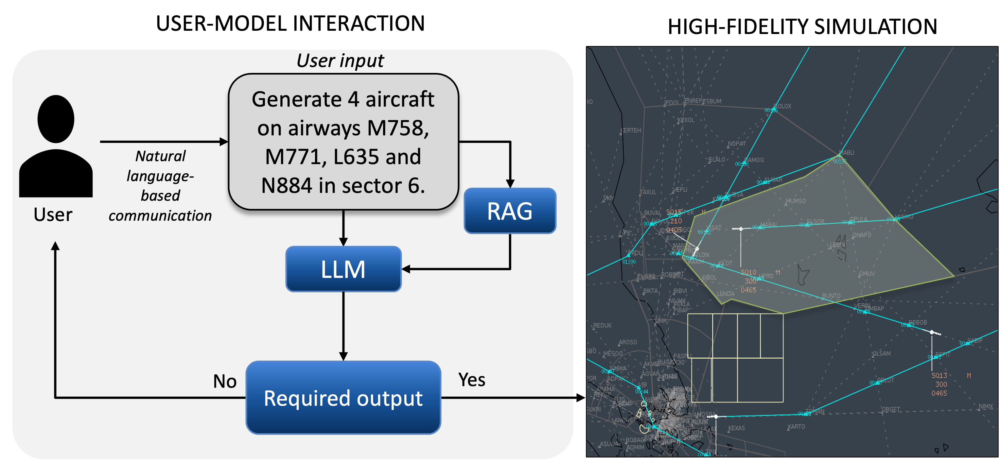

# Hi!

I am Yash. I am currently a research fellow at the Air Traffic Management Research Institute, Nanyang Technological University Singapore. Here, I 
work at the intersection of machine learning, optimization, and air traffic control, with the aim to address the near future air traffic demands.

Currently, I am working with a team of 3 scientists on using large language models to generate safety-critical scenarios in the en-route phase of the aircraft. The primary motivation for this work stems from the scarcity of conflict scenarios in the historical data and the complexity and iterations involved in creating such scenarios, and the difficulty in customization and interactive enhancement of the traffic scenarios using traditional techniques. The overall idea is :

  

The detailed methodology adopted is as follows:

The GitHub repository: [Scenario_generation](https://github.com/yashGuleria/LLMs_For_Scenario_Generation)

## A few past projects:

### Enhancing air traffic conflict resolution through machine learning, conformal automation, and flow-centric paradigms 

* Developed a novel methodology incorporating supervised machine learning, to predict air traffic controllers' conflict resolution strategies.
* Developed an experimental interface in collaboration with EUROCONTROL, to conduct human-in-loop experiments with expert air traffic controllers from Singapore and France.
* Performed human-in-loop validation experiments to test the acceptability of machine-learning prediction for air traffic conflict resolution.
* Developed a reinforcement learning-based model to incorporate air traffic controller's knowledge into an agent capable of performing ATCO-like conflict resolution. 
* Conceptualized and investigated air traffic conflict resolution in flow-centric operations, where the traffic was modeled as intersecting flows.  

### Deep reinforcement learning for air traffic conflict resolution under traffic uncertainties.

* Developed a deep reinforcement learning architecture for air traffic conflict resolution in structured airspace, using heading vector control, under uncertainties of traffic cross-track deviation(location) and speed.
* Results demonstrated that the ownship aircraft achieves safe separation for 100\% of the conflicts for the designed scenarios
* The publication won the best paper award for the session \textit{'AI in Support of Operational Decision Making'}.

## Workshops and Tutorials
### International Conference on Research in Air Transportation (ICRAT 2024)
* Local organizing committee member for the 11the International Conference on Research in Air Transportation (ICRAT 2024).

### Applications of Reinforcement learning in ATM/ANS: 
*European Union Aviation Safety Agency (EASA)*, Cologne, Germany, Sept 11 - Sept 13 2023
* Delivered a 3-day training course and workshop at the EASA headquarters in Cologne, Germany, on the foundations of reinforcement learning and its applications in air traffic conflict detection and resolution.}

### Human-AI Hybrid Teaming in ATM: Overcoming Barriers and Charting the Path Forward, Nanyang Technological University, Singapore
* Conducted a workshop on innovative research and operational perspectives on acceptance, challenges, and operational aspects of Human and AI teaming, with speakers from the Centre for Human Performance Research (CHPR NL/USA), Air Traffic Management Research Institute, NTU Singapore, and Civil Aviation Authority of Singapore.

## Other activities:
I enjoy working out early mornings 5-6 times a week. Apart from that I love music  and am intrigued by the pace at which AI is evolving.

